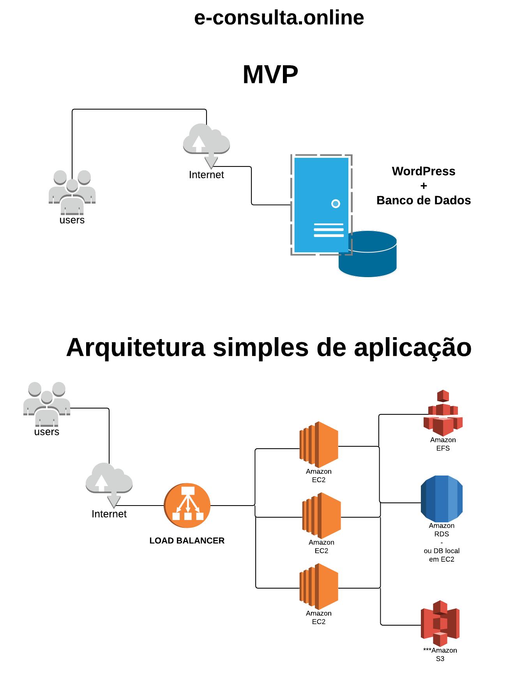
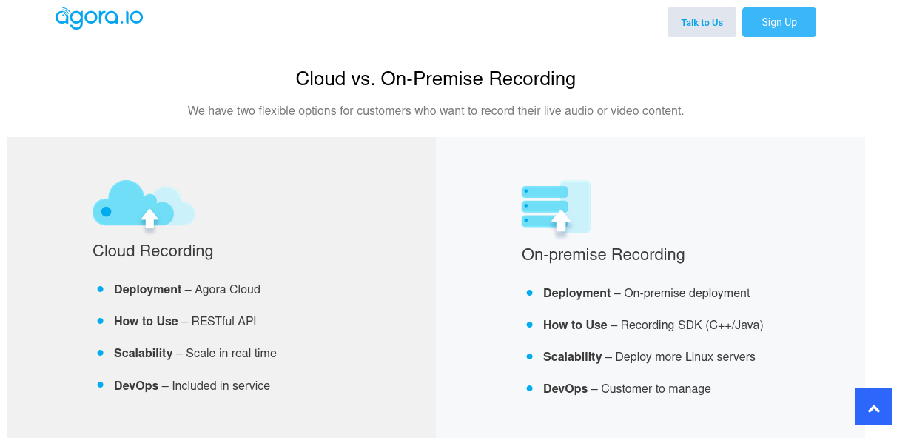

# Repositório e-consulta.online

[www.e-consulta.online](https://www.e-consulta.online/)

## Overview

Segue um overview sobre arquitetura(s). O MVP (Produto viável mínimo) se encontra em uma VPS com aplicações como webserver, WordPress e Banco de Dados na mesma instância. Em uma segunda arquitetura, onde poderia ser estudado a viabilidade na AWS também foram incluídos componentes como load balancer, AWS EFS (para sistema de arquivo compartilhado entre as instâncias EC2) e a separação do Banco de Dados utilizando RDS (Aurora MySQL).





## Referências de arquitetura escalável de WordPress em AWS

[WordPress - melhores práticas](https://d1.awsstatic.com/whitepapers/pt_BR/wordpress-best-practices-on-aws.pdf?did=wp_card&trk=wp_card)


[WordPress - AWS sample](https://github.com/aws-samples/aws-refarch-wordpress)


# Recomendações

* Nativamente o WordPress não é stateless, logo, é necessário utilizar um sistema de arquivos de rede compartilhado que contenha as informações de plugins, uploads, configurações, etc.
* Por características da aplicação, se possível, seria interessante ter um desacoplamento com o intuito de simplificar deploys com containers, infraestrutura como código, etc. Resumindo, viabilizar a aplicação sem a necessidade do WordPress.
* Requisitos de CPU, memória, disco, teste de carga ainda são obscuros e dependem de mais  detalhes da arquitetura do produto, budget/princing, opção de gravação. Exemplo: [record options](https://www.agora.io/en/real-time-recording/)




# Teste básico de WordPress com docker-compose

Requisitos

* Docker
* Docker-compose 

```
# cd wordpress-compose
# docker-compose up -d       ### inicia o WP para ser acessado localmente em http://127.0.0.1
```

Mais comandos úteis

```
# Após realizar alguma alteração no arquivo docker-compose.yml
docker-compose pull
docker-compose up -d

# Inicia todos containers com status stop no diretório
docker-compose start
# Parar todos os containers ativos no diretório
docker-compose stop
# Validar e mostrar a configuração
docker-compose config
# Listar todos os containers que estão rodando
docker-compose ps
# Parar e remover todos os containers no diretório
docker-compose down
```